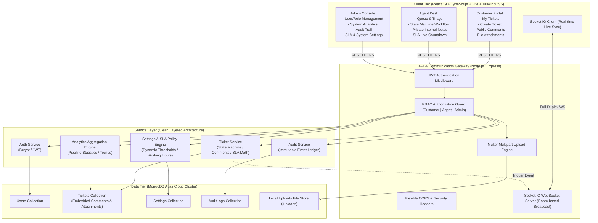

# ServiceDesk System Architecture & Engineering Specification

## 1. Executive Summary

ServiceDesk is a high-availability, multi-tenant B2B Customer Support and IT Service Management (ITSM) platform built with a modern decoupled full-stack architecture. The platform is engineered to support role-based workflows for **Customers**, **Support Agents**, and **System Administrators**, featuring strict finite state machine ticket transitions, live dynamic SLA target calculation, room-based real-time WebSocket communications, multipart file attachments, and immutable audit logging.

---

## 2. System Architecture Diagram

---

## 3. Core Architectural Subsystems

### 3.1 Controlled Finite State Machine (FSM)
Tickets follow an explicit, deterministic state graph. Direct or illegal jumps (e.g. `OPEN` directly to `RESOLVED`) are strictly intercepted and rejected with HTTP `400` and error code `INVALID_STATUS_TRANSITION`.

$$\text{OPEN} \longrightarrow \text{TRIAGED} \longrightarrow \text{ASSIGNED} \longrightarrow \text{IN\_PROGRESS} \longrightarrow \begin{cases} \text{WAITING\_FOR\_CUSTOMER} \longleftrightarrow \text{IN\_PROGRESS} \\ \text{RESOLVED} \longrightarrow \text{CLOSED} \end{cases}$$

* **Reopen Policy:** Tickets in `RESOLVED` can be reopened to `IN_PROGRESS` or closed by Customer/Agent. Reopening a `CLOSED` ticket is reserved exclusively for Administrators.

### 3.2 Dynamic SLA Engine
SLA target deadlines (`dueSLA` and `firstResponseDeadline`) are calculated dynamically upon ticket creation based on priority policies stored in MongoDB:

| Priority Tier | Default Response SLA | Default Resolution SLA | Visual Alert Threshold |
| :--- | :--- | :--- | :--- |
| **Critical** | 15 Minutes | 4 Hours (240 min) | $< 60$ min remaining (Red Pulse) |
| **High** | 1 Hour (60 min) | 8 Hours (480 min) | $< 2$ hours remaining (Orange) |
| **Medium** | 4 Hours (240 min) | 24 Hours (1440 min) | $< 4$ hours remaining (Yellow) |
| **Low** | 8 Hours (480 min) | 72 Hours (4320 min) | Standard (Green/Blue) |

### 3.3 Zero-Leakage Confidential Internal Notes
* Agents and Administrators can flag comments with `isInternal: true` for sensitive operational collaboration.
* The API layer automatically scrubs `isInternal: true` records whenever the requester's role is `customer`, guaranteeing zero confidential data leakage across tenant boundaries.

### 3.4 Room-Based Real-time WebSockets
Socket.IO partitions connections into logical broadcast rooms:
* `role:agent` & `role:admin` — Queue updates and real-time operational notifications.
* `user:<userId>` — Targeted personal ticket assignment and customer status alerts.
* `ticket:<ticketId>` — Real-time live discussion threads and status updates.

---

## 4. API Specification Matrix

| Method | Endpoint | Access Level | Description |
| :--- | :--- | :--- | :--- |
| `POST` | `/api/v1/auth/register` | Public | Register a new user account |
| `POST` | `/api/v1/auth/login` | Public | Authenticate user & issue JWT |
| `GET` | `/api/v1/auth/me` | Authenticated | Retrieve current session profile |
| `GET` | `/api/v1/tickets` | Authenticated | List paginated tickets (role-filtered) |
| `POST` | `/api/v1/tickets` | Authenticated | Create a ticket with computed SLA |
| `GET` | `/api/v1/tickets/:id` | Authenticated | Retrieve ticket detail (scrubbed for customer) |
| `PATCH` | `/api/v1/tickets/:id/status` | Authenticated | Advance ticket through state machine |
| `POST` | `/api/v1/tickets/:id/assign` | Agent / Admin | Assign ticket to an agent |
| `POST` | `/api/v1/tickets/:id/comments` | Authenticated | Post public comment or internal note |
| `POST` | `/api/v1/tickets/:id/attachments` | Authenticated | Multipart upload file attachment |
| `DELETE` | `/api/v1/tickets/:id/attachments/:attId` | Authenticated | Remove attachment from ticket and disk |
| `DELETE` | `/api/v1/tickets/:id` | Admin | Delete ticket |
| `GET` | `/api/v1/dashboard/summary` | Authenticated | Dashboard KPI metrics |
| `GET` | `/api/v1/analytics` | Agent / Admin | Aggregated trend charts & workload data |
| `GET` | `/api/v1/audit-logs` | Admin | Query immutable system audit logs |
| `GET` | `/api/v1/users` | Agent / Admin | List platform users & agents |
| `PATCH` | `/api/v1/users/:id/role` | Admin | Promote / demote user role |
| `GET` | `/api/v1/settings` | Authenticated | Fetch system settings & SLA policies |
| `PATCH` | `/api/v1/settings` | Admin | Update SLA thresholds and rules |
| `GET` | `/api/v1/sla` | Agent / Admin | Fetch active SLA tier matrix |
